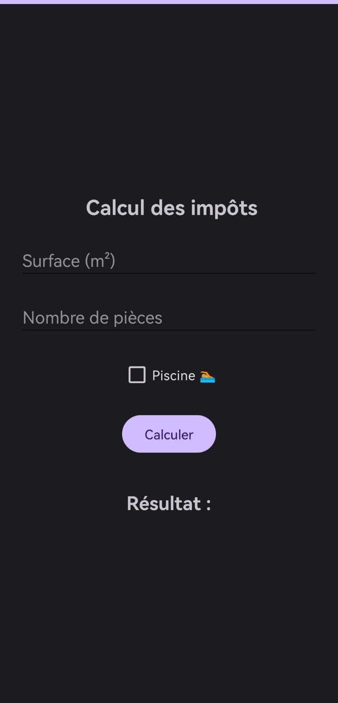
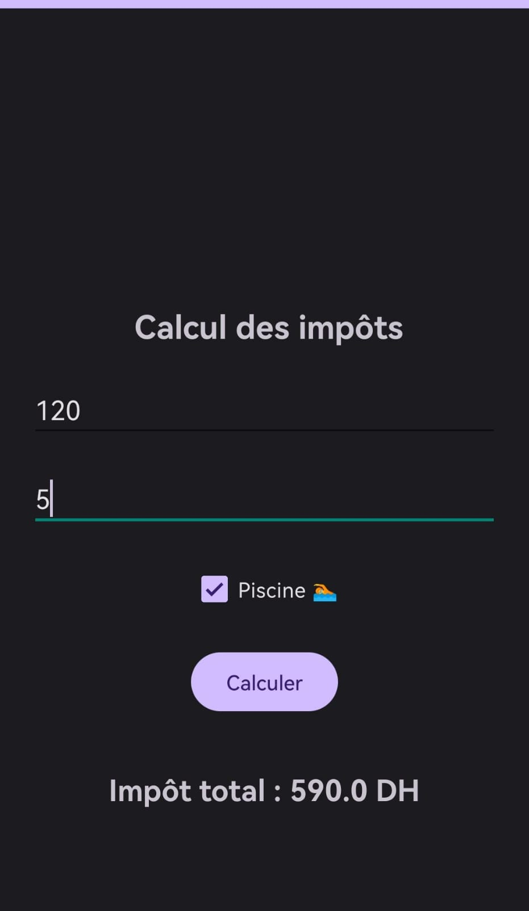
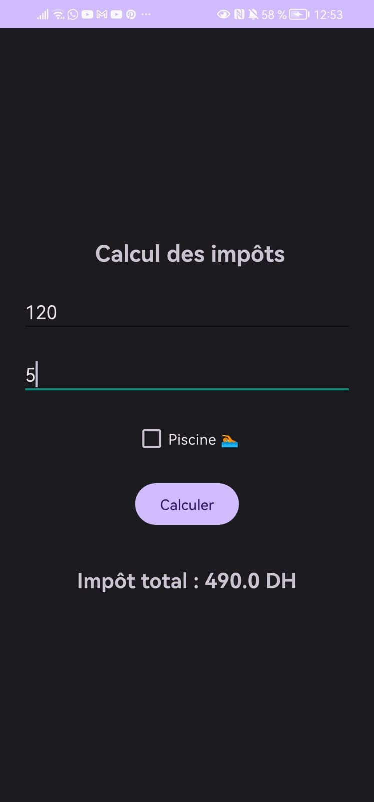

# LAB 2 – Calculateur d’impôts locaux

##  Objectif
Développer une application Android permettant de calculer le montant total des impôts locaux en fonction de :
- la surface de la maison
- le nombre de pièces
- la présence d’une piscine
##  Méthode de calcul

Le calcul est basé sur la formule suivante :

Impôt = (surface × 2) + (pièces × 50) + (100 si piscine)

---

###  Interface de l’application

###  Résultat du calcul

##  Résultat sans piscine

---

##  Fonctionnalités
- Saisie de la surface et du nombre de pièces   
- Choix de la présence d’une piscine  
- Calcul automatique des impôts  
- Affichage du résultat 
- Vérification des champs (anti-erreur) 

---

##  Exécution
L'application a été testée sur un téléphone réel via USB Debugging, sans utiliser d’émulateur.

---

